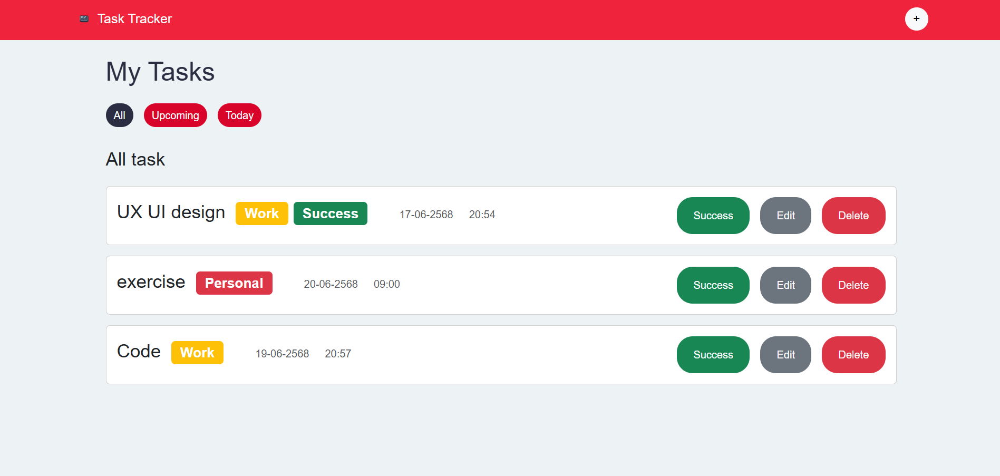

# 📋 Task Tracker App

A simple and clean React application that helps users manage tasks, categorize them, and track their progress. Ideal for daily planning, studying, and increasing productivity.



---

## 🚀 Features

- ✅ Add new tasks with:
  - Title
  - Category (Work / Personal / Other)
  - Due date and time
- 🗂️ Filter tasks by category
- ✏️ Edit or delete tasks
- ☑️ Mark tasks as completed
- 🔁 Data persistence with `localStorage`

---

## 🛠️ Tech Stack

- ⚛️ React (Functional Components & Hooks)
- 🧠 React Hooks (`useState`, `useEffect`)
- 💾 localStorage for data saving
- 🎨 Bootstrap 5 (via npm)

---

## 📦 Installation

```bash
# 1. Clone the repository
git clone https://github.com/Sahapap1/task-tracker-app.git

# 2. Navigate to the project directory
cd task-tracker-app

# 3. Install dependencies
npm install

# 4. Start the development server
npm start
```

---

## 📁 Folder Structure

```
src/
├── components/
│   ├── TaskForm.jsx        # Form to add/edit tasks
│   ├── TaskItem.jsx        # Single task card
│   ├── TaskList.jsx        # List of tasks
│   └── FilterBar.jsx       # Category filters
│   └── Modal.jsx
│   └── Nav.jsx
├── style/
│   └── FilterBar.css
│   └── Modal.css
│   └── TaskForm.css
│   └── TaskItem.css
├── utils/
│   └── storage.js          # LocalStorage helper
├── App.jsx
├── index.js
└── styles.css
```

---

## 📌 Usage

1. 📝 Add a task with a title, category, and due time.
2. 🧹 View tasks in list format.
3. 🔍 Use the filter bar to see tasks in a selected category.
4. ✅ Click to mark a task as complete.
5. 🗑️ Delete or edit tasks at any time.
6. 🔁 Refresh the page — your data is still there!

---

## 📸 Screenshots
  
> ./screenshots/home.png
> ./screenshots/add-task-form.png

---

## 🙌 Acknowledgements

Inspired by productivity tools like Notion, Todoist, and Trello. Built for learning and fun ❤️
